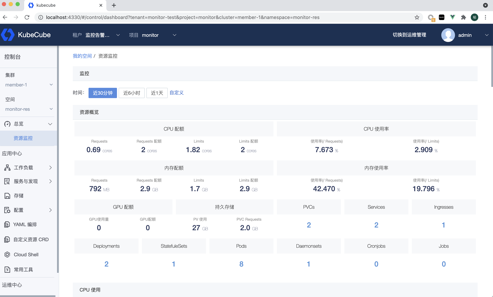
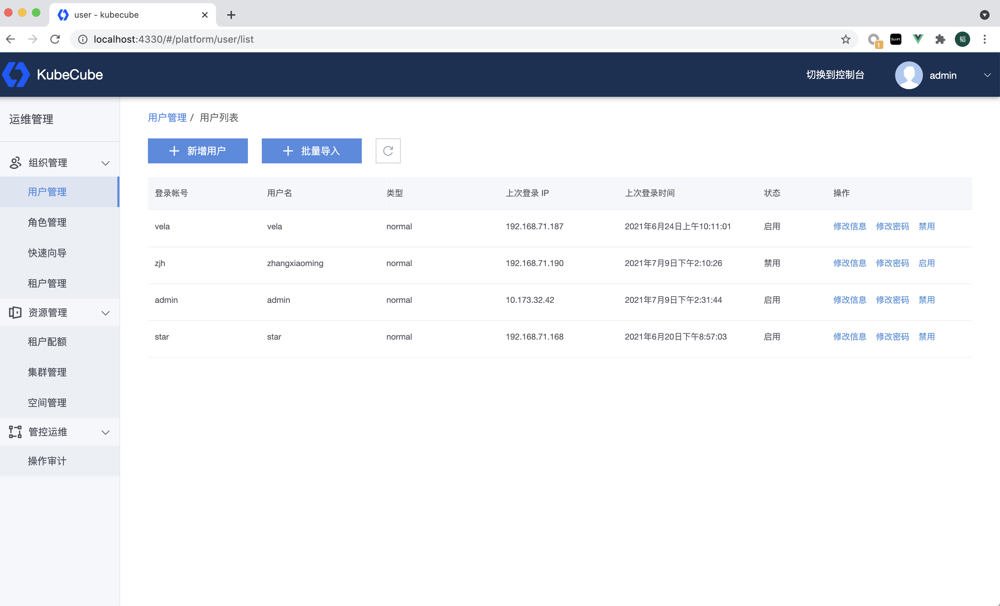
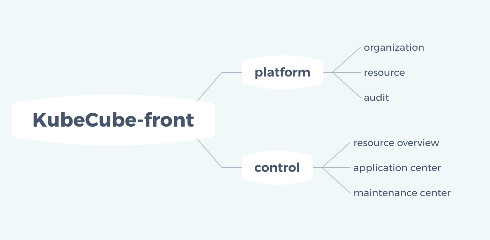

# KubeCube-front

[](https://github.com/kubecube-io/kubecube/blob/main/LICENSE)

KubeCube-front is the front-end project of KubeCube.


## Features
### Structure



## Quick Start
``` shell
npm install
npm run build
docker build .
```
Put the packaged front-end image in the container of the frontend deployment under the Kubecube-system namespace.

## For Developers
### Preparation 
+ Node.js 12.18+

Install dependencies

``` shell
npm i 
```

Configure the proxy development server, the path is in config/webpack.dev-server.js

``` javascript
module.exports = function() {
    return {
        compress: true,
        hot: true,
        // https: true,
        // stats: 'errors-only',
        headers: {
            'Access-Control-Allow-Origin': '*',
            'Access-Control-Allow-Methods': 'GET, POST, PUT, DELETE, PATCH, OPTIONS',
            'Access-Control-Allow-Headers':
                'X-Requested-With, content-type, Authorization',
        },
        proxy: {
            // kubecube service
            '/api/v1/cube': {
                target: 'https://10.173.32.42:30443',
                secure: false,
                changeOrigin: true,
            },
            // logseer service
            '/api/v1/logseer': {
                target: 'http://10.173.32.42:32147',
            },
            // promethues service
            '/api/v1/label': {
                target: 'http://10.173.32.42:31090',
            },
            '/api/v1/series': {
                target: 'http://10.173.32.42:31090',
            },
            '/api/v1/query': {
                target: 'http://10.173.32.42:31090',
            },
            '/api/v1/query_range': {
                target: 'http://10.173.32.42:31090',
            },

            // webconsole service
            '/api/v1/webconsole': {
                target: 'http://10.173.32.42:30010',
                pathRewrite: { '^/api/v1/webconsole': '/api/v1' },
            },
            '/webconsole/api/sockjs': {
                target: 'http://10.173.32.42:30010',
                pathRewrite: { '^/webconsole/api/sockjs': '/api/sockjs' },
            },

            // audit service
            '/api/v1/audit': {
                target: 'http://10.173.32.42:30008',
                pathRewrite: { '^/api/v1/audit': '/api/v1/cube/audit' },
            },
            // 10.173.32.42:30010/api/v1/pivot-cluster/pod/es/es-0/shell/wb-test-nginx
        },
    };
};
```

### develop
``` shell
npm run dev 
```

Follow the prompts to open the development address:
``` shell
  App running at:
  - Local:   http://localhost:4330/public/

  Note that the development build is not optimized.
  To create a production build, run npm run build.

```

## License

```
Copyright 2021 KubeCube Authors

Licensed under the Apache License, Version 2.0 (the "License");
you may not use this file except in compliance with the License.
You may obtain a copy of the License at

    http://www.apache.org/licenses/LICENSE-2.0

Unless required by applicable law or agreed to in writing, software
distributed under the License is distributed on an "AS IS" BASIS,
WITHOUT WARRANTIES OR CONDITIONS OF ANY KIND, either express or implied.
See the License for the specific language governing permissions and
limitations under the License.
```